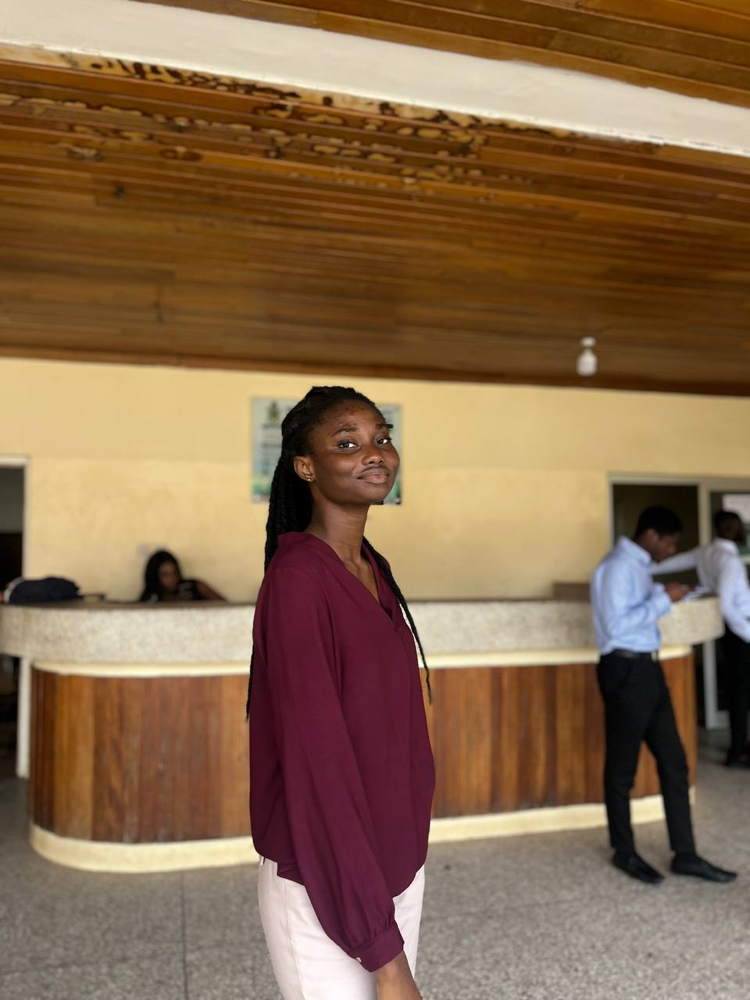
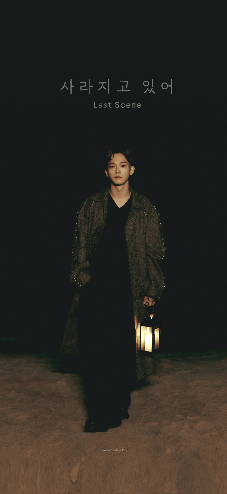
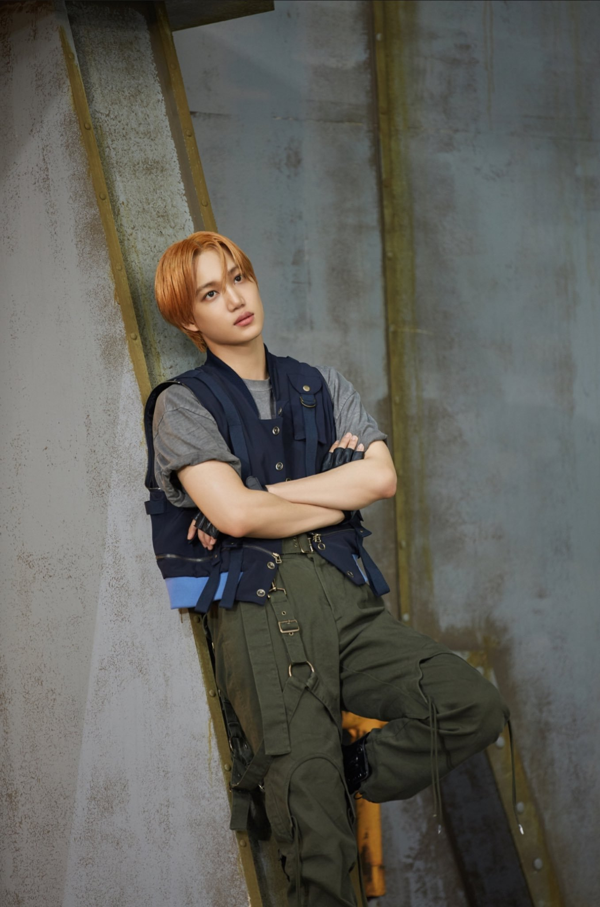

<!DOCTYPE html>
<html lang="en">
<head>
    <meta charset="UTF-8">
    <meta name="viewport" content="width=device-width, initial-scale=1.0">
    <title>Document</title>
</head>
<body>
    <header>
        <nav>
            <ul> 
                      
               <li><a href="#">Courses</a></li>
                <li><a href="#">Pricing</a></li>
                <li><a href="#">Login</a></li>
            </ul>
        </nav>
    </header>
    <main>
        

        <section>
            <h1>Get schooled</h1>
             Smile
             Grin
             Laugh
            <button>Register for free</button>
       

    

         <h2>learn from the pros</h2>
         

            

            
            <h4>Kim Minseok</h4>
            
The CEO

            

        

            
            <h4>Kim Suho</h4>
            
Managing Director

        

        

            
            <h4>Oh Sehun</h4>
            
Programs Manager

        

        

            
            <h4>Lay Yixing</h4>
            
Supervisor

        

    </section>
       <section>
        

        
    

       

    <q>These tutorials are concise and go straight to the point. I can't think of a better place to learn smiling. it is so much fun!</q>
     <h4>Sally</h4>
     
Benefector

      

           </section>
              <section>
                    <h2>The purpose of the programme</h2>
        

       <video src="video/trebit.mp4"width="150px" height="150px" controls>video of trebit </video>
          
          <h4>Han Jisung</h4>
                    
Jisung explain the benefits of joining the programme

                    

                        

                    <video src="video/search bar.mp4" width="150px" height="150px" controls>video of search</video>
         
         <h4>Kim Chen</h4>
         
Chen explaining how affordable it is to enroll

        

        

         <video src="video/tFoot.mp4" width="150px" height="150px" controls>video of table foot</video>
        
        <h4>Fellow Men</h4>
        
The big men singing the main theme for this year

         

           

        <video src="video/nesting.mp4" width="150px" height="150px" controls>video of controls</video>
         
         <h4>Kim Kai</h4>
         
Kai explain the impact of the programme to the yputh globally

        

         
         <h4>Byun Baekhyun</h4>
         &#9733;
         &#9733;
         &#9733;
         &#9734;
         &#9734;
         
Ratings for the programme by the youth around the world

        

        </section>
             <section>

          <h2>Membership</h2>
          
          <h4>Full name</h4>
          
Write your names in full

        

        

          
          <h4>Email address</h4>
          
Enter your correct email address

          
          <h4>your location</h4>
          
Enter your current location

        
 
        

          
          <h4>Contacts</h4>
          
Fill in your contact

        

          <button>Button</button>
       </section>
       

       <section>
        <h2>F.A.Q</h2>
        

        <H4>How does it work</H4>
    

    

        
Registration is a necessary mandate and without that individuals cannot be enrolled

    

    

        <h4>How does it work</h4>
        
Registration is done online. Click on the link below. you will be sent to another page where you will fill your information and make payment.

    

    

        <h4>How does this work</h4>
        
An email will be sent to you after  a few days of registration, if you don't receive any email reach out to us by the contact details provided

    

    

        <h4>How does this work</h4>
        
A final  email will be sent to you a week before the programme starts detailing the schedules for every events to be taken place and the contacts of your respective mentors so please reach out to them when faced any challenges

    

    </section>
    </main>
    <footer>
                <section>
                    

                                        

                

                    <a href="https://www.linedin.com" target="_blank"><svg xmlns="http://www.w3.org/2000/svg" x="0px" y="0px" width="100" height="100" viewBox="0 0 24 24">
                <path d="M21,3H3v18h18V3z M9,17H6.477v-7H9V17z M7.694,8.717c-0.771,0-1.286-0.514-1.286-1.2s0.514-1.2,1.371-1.2 c0.771,0,1.286,0.514,1.286,1.2S8.551,8.717,7.694,8.717z M18,17h-2.442v-3.826c0-1.058-0.651-1.302-0.895-1.302 s-1.058,0.163-1.058,1.302c0,0.163,0,3.826,0,3.826h-2.523v-7h2.523v0.977C13.93,10.407,14.581,10,15.802,10 C17.023,10,18,10.977,18,13.174V17z"></path>
            </svg></a>
            <a href="https://www.gmail.com" target="_blank"><svg xmlns="http://www.w3.org/2000/svg" x="0px" y="0px" width="100" height="100" viewBox="0 0 50 50">
                <path d="M12 23.403V23.39 10.389L11.88 10.3h-.01L9.14 8.28C7.47 7.04 5.09 7.1 3.61 8.56 2.62 9.54 2 10.9 2 12.41v3.602L12 23.403zM38 23.39v.013l10-7.391V12.41c0-1.49-.6-2.85-1.58-3.83-1.46-1.457-3.765-1.628-5.424-.403L38.12 10.3 38 10.389V23.39zM14 24.868l10.406 7.692c.353.261.836.261 1.189 0L36 24.868V11.867L25 20l-11-8.133V24.868zM38 25.889V41c0 .552.448 1 1 1h6.5c1.381 0 2.5-1.119 2.5-2.5V18.497L38 25.889zM12 25.889L2 18.497V39.5C2 40.881 3.119 42 4.5 42H11c.552 0 1-.448 1-1V25.889z"></path>
                </svg></a>
            <a href="https://www.twitter.com" target="_blank"><svg xmlns="http://www.w3.org/2000/svg" x="0px" y="0px" width="100" height="100" viewBox="0 0 50 50">
                <path d="M 6.9199219 6 L 21.136719 26.726562 L 6.2285156 44 L 9.40625 44 L 22.544922 28.777344 L 32.986328 44 L 43 44 L 28.123047 22.3125 L 42.203125 6 L 39.027344 6 L 26.716797 20.261719 L 16.933594 6 L 6.9199219 6 z"></path>
                </svg></a>
            

                
Reach out to us

        </section>
    </footer>
</body>
</html>